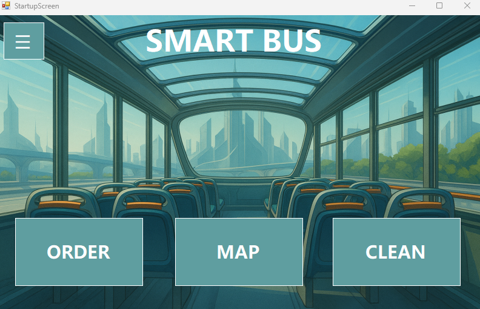

# Smart Bus System - User Interface Project
 
 
  A C# Windows Forms application that simulates a smart bus environment with integrated services for passengers, drivers, and staff.
  The system provides features such as passenger registration, employee access, food ordering, landmark navigation, cleaning management, and a digital help manual.
## About The Project
The Smart Bus System is designed to demonstrate how different digital services could be integrated into a modern public transportation system.
The application simulates multiple subsystems that would normally exist in a smart transportation environment, including:
 - Passenger interaction with the bus system
 - Employee access and driver tools
 - On-board services such as food ordering
 - Navigation assistance using landmarks
 - Cleaning workflow for maintenance staff
 - A digital help manual for users
The goal of the project is to showcase GUI design, system modularity, and user interaction using C# Windows Forms.
## Getting Started
### Built With
 - C#(.NET)
 - Windows Forms
### Prerequisites
 - Any C# IDE that supports WinForms (e.g., Visual Studio, Rider, VS Code with C# extension)
 - .NET runtime installed
## Installation
1. Clone the repository
2. Open the solution file in Visual Studio
3. Build the project
4. Run the application
## Usage
The application opens a graphical interface where users can access different modules of the Smart Bus system.
Typical workflow:
1. Launch the application
2. Sign in as an Employee or a Passenger
3. Interact with the GUI features (cleaning, navigation, food ordering, etc.)
4. Access the help manual if needed
## License 
Distributed under the MIT License. See LICENSE.txt for more information.
